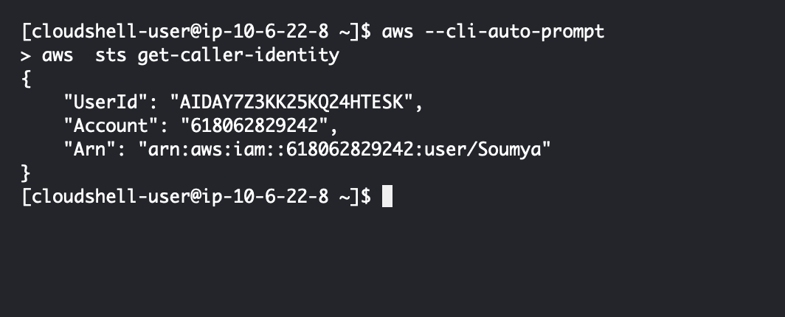
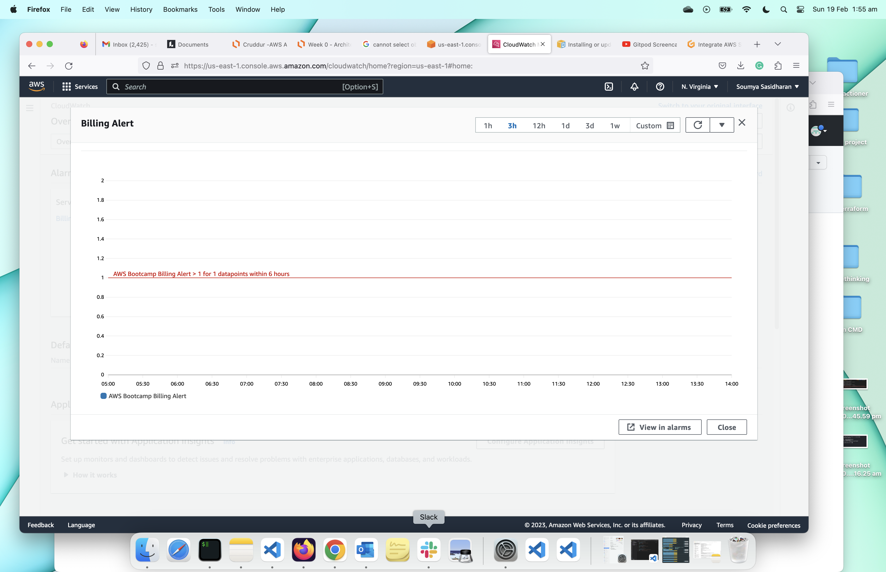
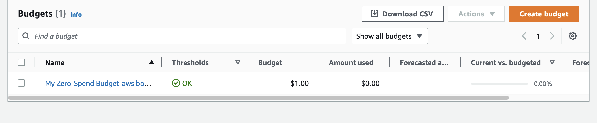
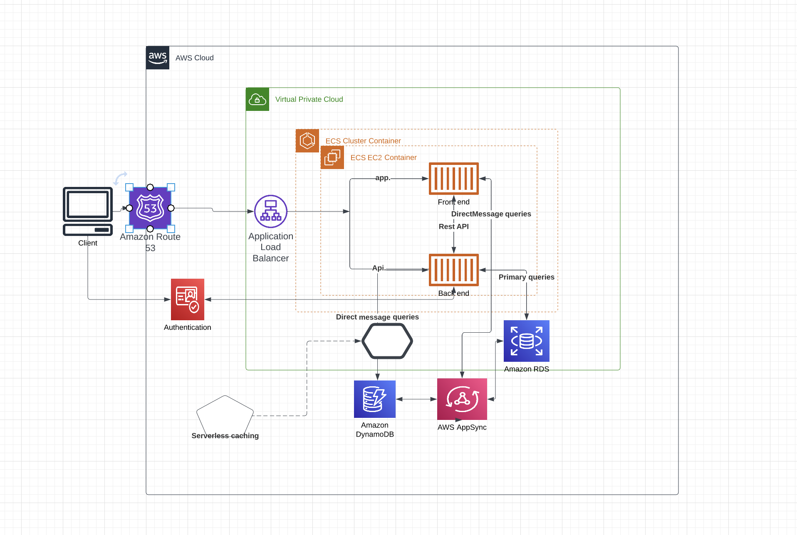
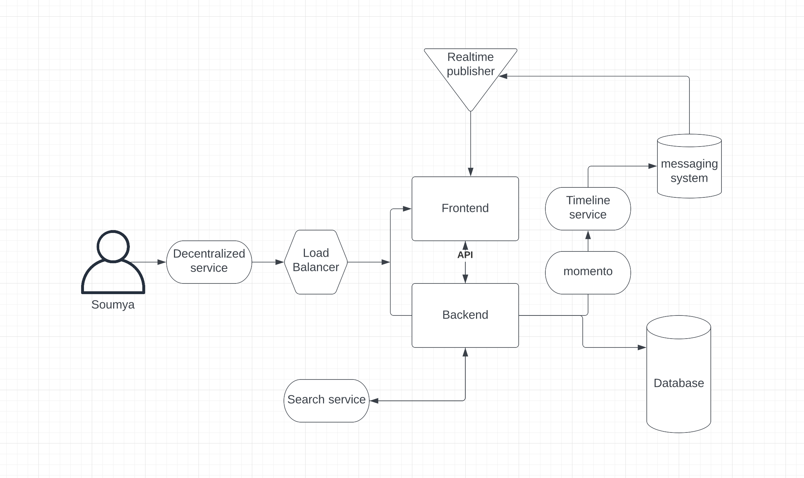

# Week 0 — Billing and Architecture

## Required home work
Install Aws CLI
##
I installed aws cli on my computer and saved my credentials in the credential file in my local computer .
I need to be more comfortable saving credentials in the Gitpod account.
I have mac so I folllowed mac installation instruction in local machine.
#
curl "https://awscli.amazonaws.com/AWSCLIV2.pkg" -o "AWSCLIV2.pkg"
sudo installer -pkg ./AWSCLIV2.pkg -target /
which aws
aws --version
# Also i tried gitpod installation following linux instructions
curl "https://awscli.amazonaws.com/awscli-exe-linux-x86_64.zip" -o "awscliv2.zip"
unzip awscliv2.zip
sudo ./aws/install
./aws/install -i /usr/local/aws-cli -b /usr/local/bin
aws --version
### image

# I tried in cloud shell in us east 1 region.

### image

## Homework challenge
### Created billing alarm using aws management console
image

### Created aws budget 
image

### Created conceptual diagram and architecture diagram
### links

.[lucid chart links](https://lucid.app/lucidchart/d4254219-90b1-418d-afea-35f369691d31/edit?page=0_0&invitationId=inv_2c548062-16d8-4d37-92da-80220680dfba#)

.[lucid chart links](https://lucid.app/lucidchart/d4254219-90b1-418d-afea-35f369691d31/edit?viewport_loc=-11%2C-11%2C1711%2C1005%2CPfkyiKpiuSIE&invitationId=inv_2c548062-16d8-4d37-92da-80220680dfba)

