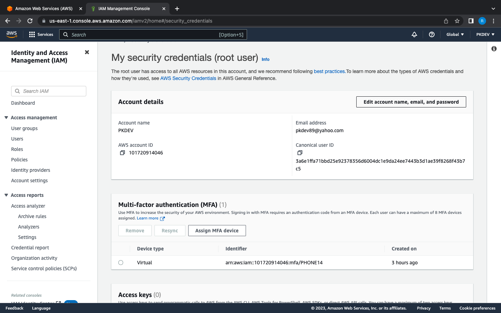
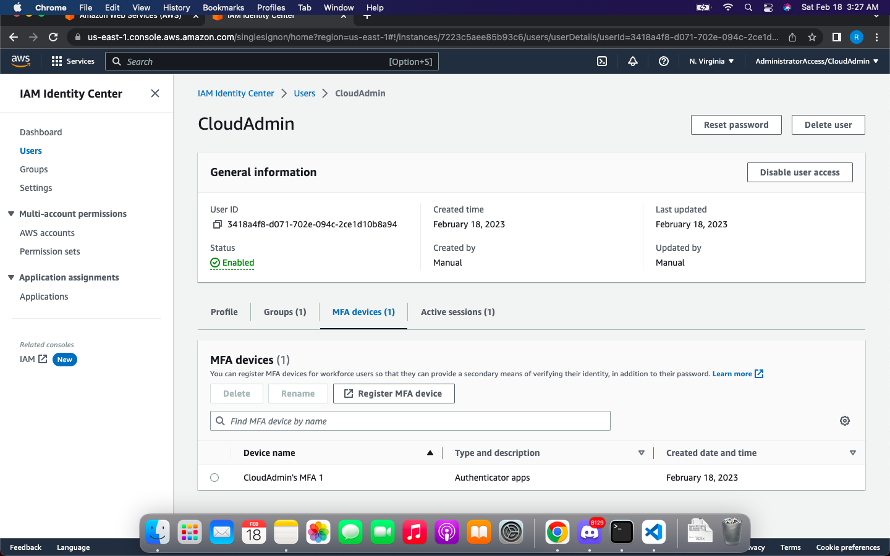
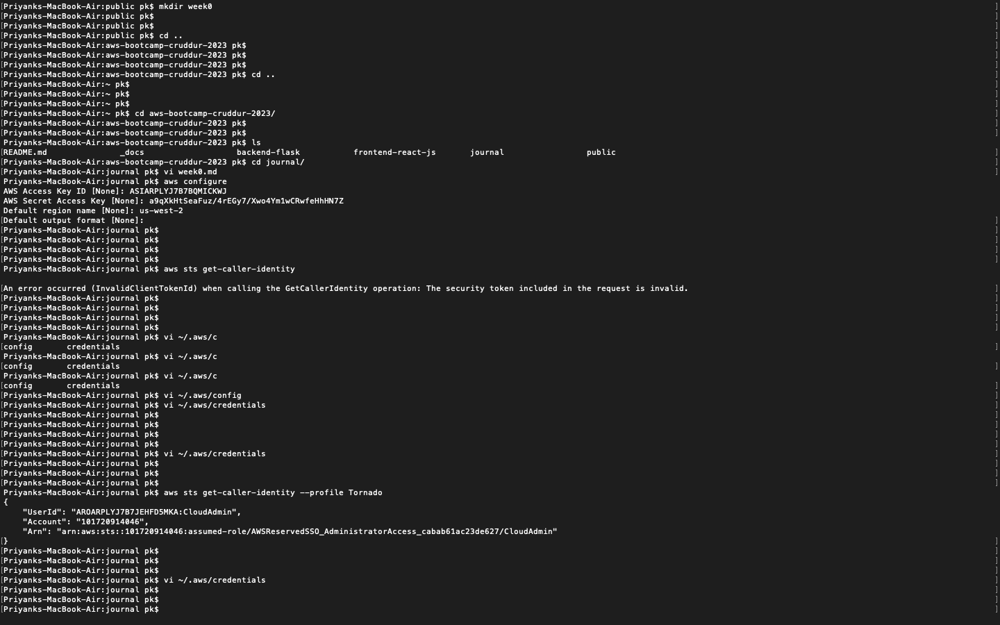
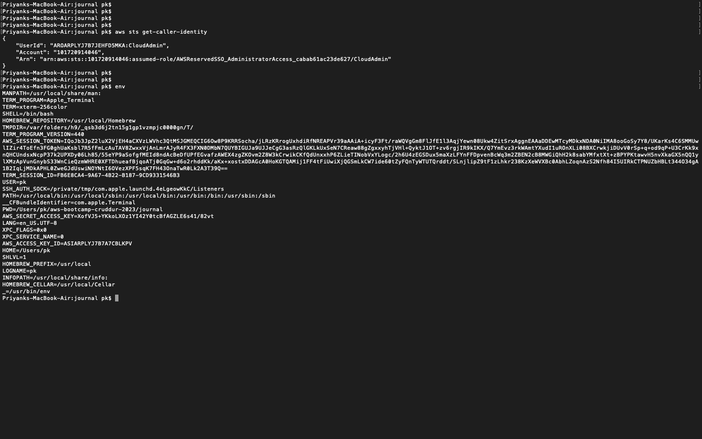
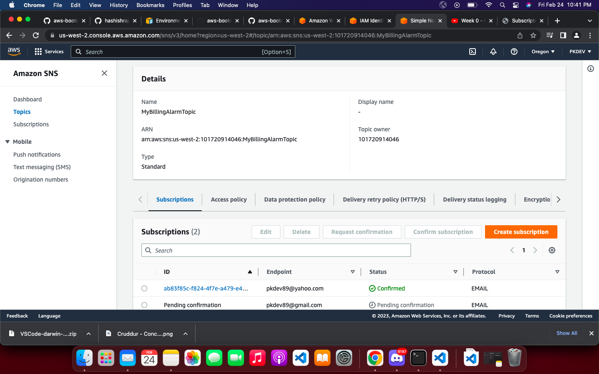
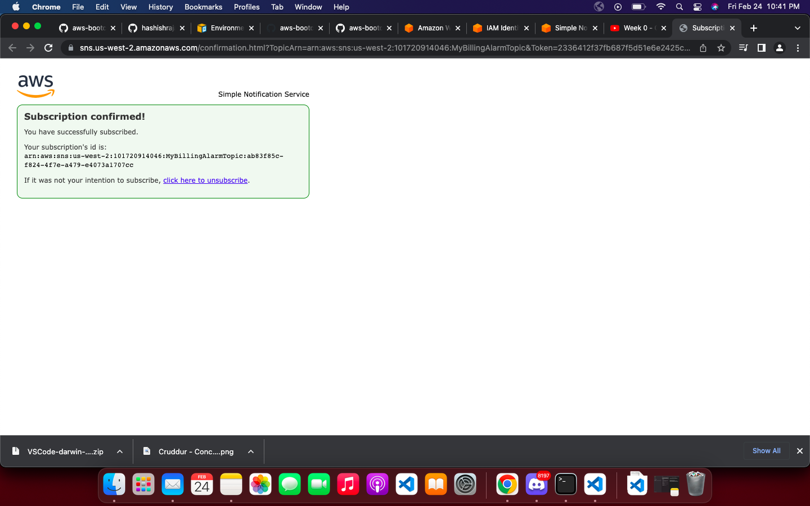
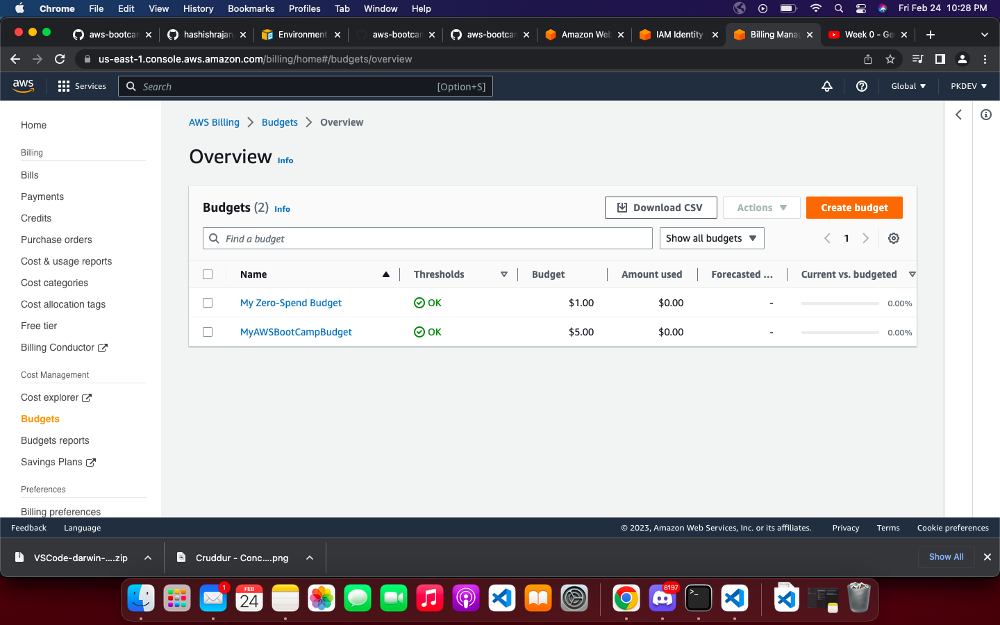

# Week 0 — Billing and Architecture


## Livestream and Hangout
- Bootcamp format
- Business usecase overview
- Lucid Charts, C4 Models 
- Architecture Diagram of the Product
- Tracking costs using aws billing dashboards - Budget, Alarms, Cost Explorer
- Understanding use guidelines of services in the AWS free tiers 
- Working with AWS Cli and Cloudshell
- Generating IAM creds 


## Account Setup 

 - AWS                ✅
 - Codespaces         ✅ 
 - Github             ✅
 - Lucid Chart        ✅ 
 - Gitpod             ✅ 
 - Momento            ✅ 
 - HoneyComb          ✅ 
 - RollBar            ✅ 
 - Custom Domain Name TODO

 ## Coursework 

 1) [ Week 0 - Live Streamed Video](https://www.youtube.com/watch?v=SG8blanhAOg&list=PLBfufR7vyJJ7k25byhRXJldB5AiwgNnWv&index=12)
 2) [ Chirag Spend Consideration](https://www.youtube.com/watch?v=OVw3RrlP-sI&list=PLBfufR7vyJJ7k25byhRXJldB5AiwgNnWv&index=13)
 3) [ Ashish Security Consideration](https://www.youtube.com/watch?v=4EMWBYVggQI&list=PLBfufR7vyJJ7k25byhRXJldB5AiwgNnWv&index=15)

## Homework Challenges

1) ### Destroy your root , setup MFA and Create IAM role. ✅

    - Delete the root users secret and access key if present. 
    - Setup MFA for root user.
     
   
      
   
    
    - Create a new IAM user named <i><b>CloudAdmin</b></i>, with console access as well as console access using credentials.
     

    - Create a Administrator group and add AdministratorAccess to it.
    - Make the user part of the group.
    - [Install AWS CLI on local machine](https://docs.aws.amazon.com/polly/latest/dg/setup-aws-cli.html)
    - Download the credentials and set up a [named profile - Tornado](https://docs.aws.amazon.com/cli/latest/userguide/cli-configure-profiles.html).
      


2) ### Validate AWS CLI is setup correctly. ✅

    ``` aws sts get-caller-identity --profile Tornado```

    


3) ### Set up a billing alarm, a budget ✅

    ## Alarm 

    1) Setting up a billing alarm.
        - Create a SNS topic 
        ```
            aws sns create-topic --name MyBillingAlarmTopic
        ```
    2) Create a subscription, provide topic and email.
        - ```
            aws sns subscribe \
            --topic-arn arn:aws:sns:us-west-2:101720914046:MyBillingAlarmTopic\
            --protocol email \
            --notification-endpoint pkdev89@yahoo.com 
        ```

    

    <br>

    

    ## Budget

    1) Create a budget using the aws cli. 

       ```
        aws budgets create-budget \
            --account-id  101720914046 \
            --budget  file://budget.json \
             --notifications-with-subscribers file://budget-notifications-with-subscribers.json
       ```

    

    Code Ref  - https://github.com/omenking/aws-bootcamp-cruddur-2023/tree/week-0/aws/json

4) ### Review all questions of well architect framework ([WAF](https://aws.amazon.com/architecture/well-architected/?wa-lens-whitepapers.sort-by=item.additionalFields.sortDate&wa-lens-whitepapers.sort-order=desc&wa-guidance-whitepapers.sort-by=item.additionalFields.sortDate&wa-guidance-whitepapers.sort-order=desc)) - ✅

5) ### Research the technical and service limits of     specific services and how they could impact the technical path for technical flexibility. - ✅

    ``` Have explored SES service quotas before and have also previously contacted AWS Support to request an increase for no of single message receipients to be increased from 50 to 200. ```

    [More Quota Info](https://docs.aws.amazon.com/ses/latest/dg/quotas.html)

6) ### Use EventBridge to hookup Health Dashboard to SNS and send notification when there is a service health issue.


7) ### Lucid Charts


## Refrences 

1) [Architecture Diagram Template](https://lucid.app/lucidchart/6f80cd2d-7d18-4731-aadc-bdda9773c092/edit?invitationId=inv_c648fee2-f691-443d-8602-7e959b41a18d&page=0_0#)

2) [Understanding Costs](https://docs.google.com/document/d/10Hec7Or1ZUedl0ye-05mVPhYFR5-ySh2K8ZbFqTxu1w/edit#bookmark=id.n67i8zg8ikxc)

3) [Chirag Video on tracking costs](https://www.youtube.com/watch?v=OVw3RrlP-sI&t=851s)

4) [Best Practices](https://docs.aws.amazon.com/IAM/latest/UserGuide/best-practices.html)


5) [Ashish video on cloud security](https://www.youtube.com/watch?v=4EMWBYVggQI&list=PLBfufR7vyJJ7k25byhRXJldB5AiwgNnWv&index=15)

6) [AWS Well Architected Framework](https://aws.amazon.com/architecture/well-architected/?wa-lens-whitepapers.sort-by=item.additionalFields.sortDate&wa-lens-whitepapers.sort-order=desc&wa-guidance-whitepapers.sort-by=item.additionalFields.sortDate&wa-guidance-whitepapers.sort-order=desc)

7) [Billing Alarms](https://docs.aws.amazon.com/AmazonCloudWatch/latest/monitoring/monitor_estimated_charges_with_cloudwatch.html#turning_on_billing_metrics) , [Budget](https://docs.aws.amazon.com/cost-management/latest/userguide/budgets-create.html)

8) [Eventbridge - health dashboard integration with SNS](https://docs.aws.amazon.com/health/latest/ug/cloudwatch-events-health.html#creating-event-bridge-events-rule-for-aws-health)


