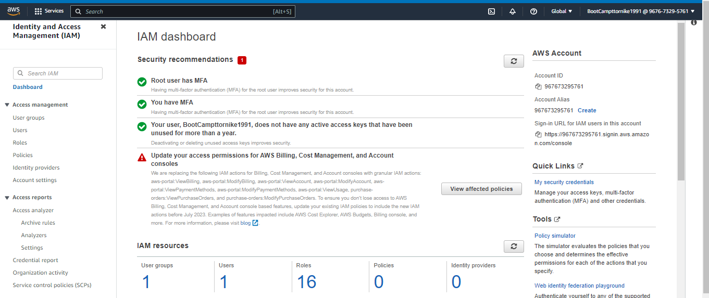
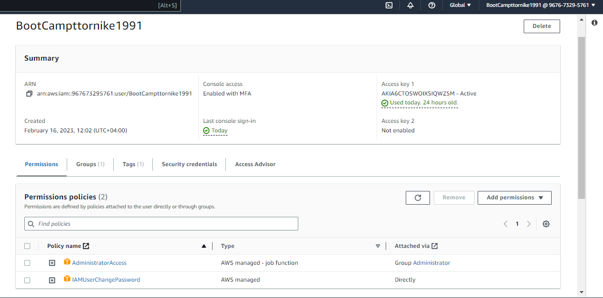
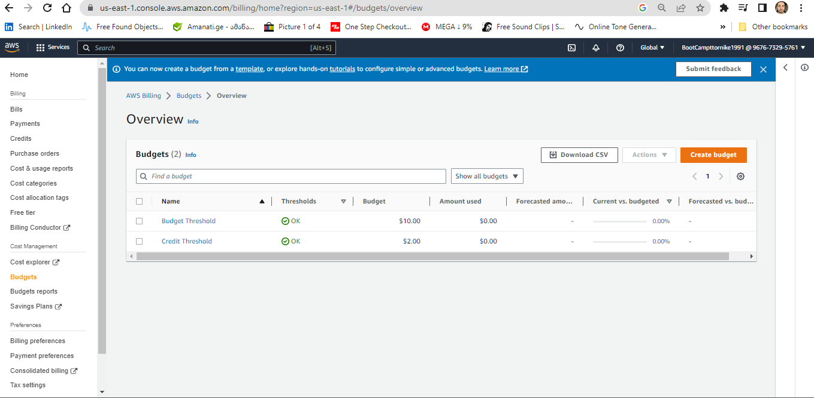
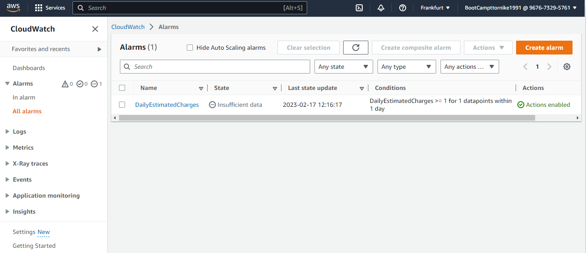
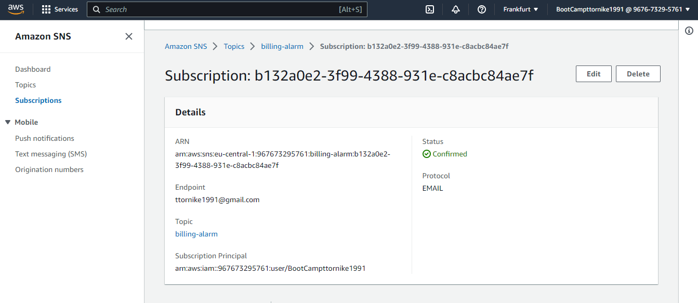
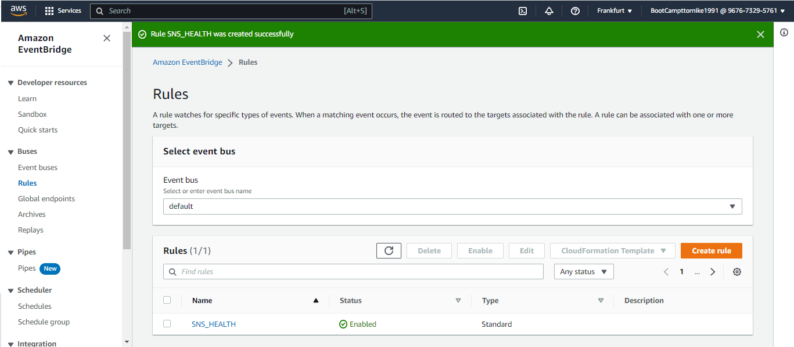

# Week 0 — Billing and Architecture

Destroyed root account credentials, set MFA, IAM role AdministratorAccess

Set a AWS Budget

Set BillingAlarm(cloudwatch)

Set SNS-TOPIC

Set BilingAlerts

Eventbridge to Hookup Health Dashboard to SNS and send notification

 
