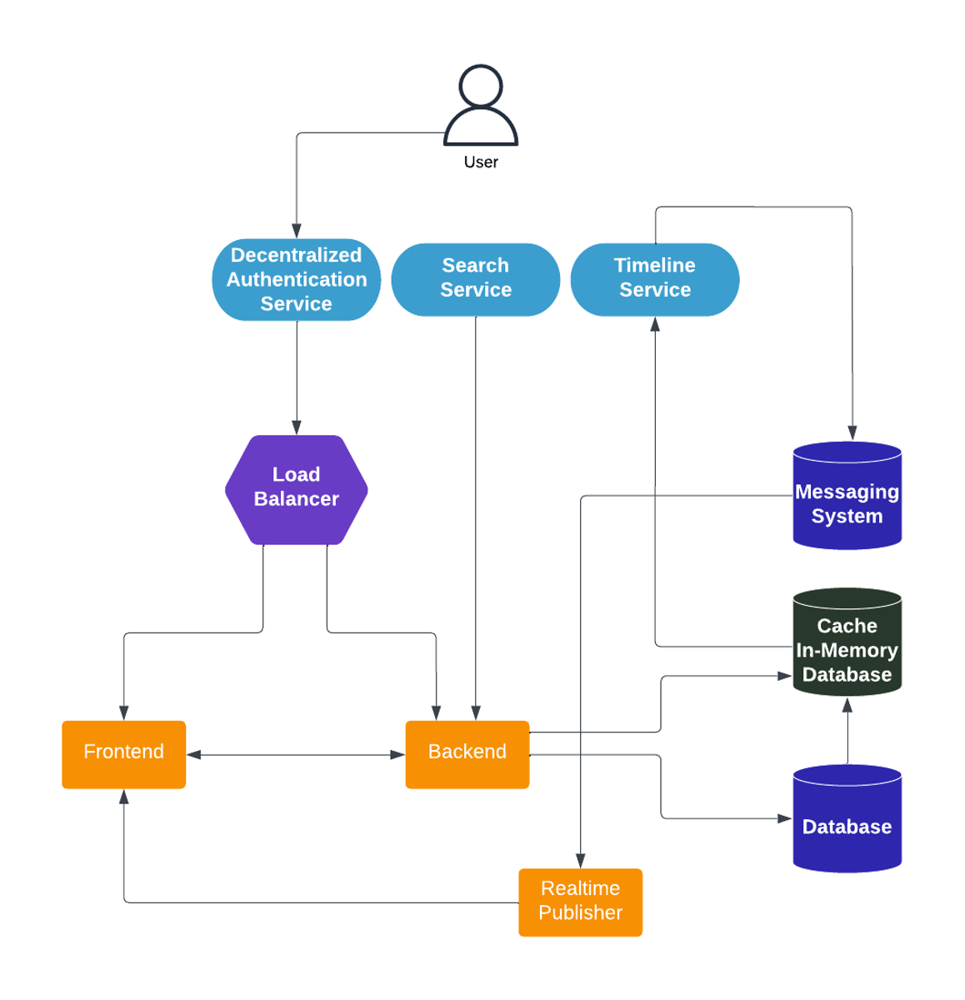
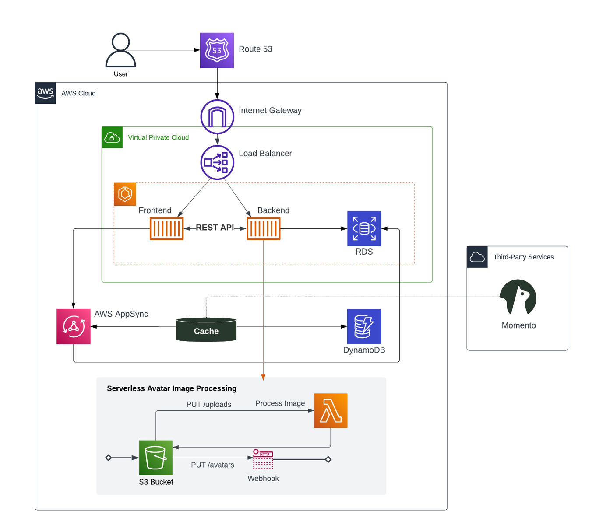

# Week 0 — Billing and Architecture

## Architecture 

The following are the Conceptual and Logical Diagram of the solution


[Lucid Conceptual Diagram](https://lucid.app/lucidchart/3d5ba386-6e17-448e-9597-6843d1d69621/edit?view_items=rh.x.8d3aRP-%2Crh.xvxYB_jhh%2Crh.x_riO4g1Q%2Crh.xrTAr_h~3%2Crh.x-H0uY95F%2Crh.x~LHdSTHF%2Crh.xL3KAfEJz%2Crh.x2yimzjxx%2Crh.x7hXhkRoF%2Crh.xwLHKUkvr%2Crh.xXBR9NQKv%2Crh.xzB67O2i.%2Crh.xm-58KxDe%2Crh.xMFfQP57l%2Crh.xt1q3jHj8%2Crh.xWQzTnjr6%2Crh.xqU~WqiYF%2Crh.xHsLA0FdF%2Crh.xE9dJPBfH%2Crh.x_FjITTyg%2Crh.xB-tlhMg5%2Crh.x~KCxZeH~%2Crh.x_ND7dH6B%2Crh.xWLZT84AF&invitationId=inv_9478e636-2c5a-44af-be68-dd9f875bbf40)


[Lucid Logical Diagram](https://lucid.app/lucidchart/e351bb0e-4222-433e-ba76-c1fc5f9c030d/edit?view_items=Hn.x5GZTecfW%2CGo.x.6uKMGST%2CKr.x6GkGeBW7%2CafaynN467coU%2C_Uayzb4W3vaj%2CHn.xCIQOR9Tg%2CHn.xIU~sil-H%2CHn.xsf5wsShq%2CHn.xNBPUeeHb%2CHn.xuMPmi4Y8%2CHn.x27JZ2BtY%2CHn.xK9-Gvx2z%2CHn.xAVI5rpvL%2CHn.x3e0Xm0_O%2CNn.xFA.2JmrY%2Cco.xSydtyF6x%2CJp.xvy3oSfsV%2CVp.xErEh-4Wj%2Ccq.xeR.wHtG1%2CPq.x4MnQmdtw%2C7q.xWmZIwya9%2CJu.x82jGzJxr%2C0u.x-LNG-q5.%2CtR.xkLGywBDV%2CRR.x8S5yEgwD%2CafayM3ISgDkn%2CafaysRcso-oa%2Cafayi~rGke12%2CafaylxWN4bj~%2Cafay4f~E6.YZ%2CafayYyv.kyx1%2Cafay_Csg-Y5R%2CafayC8xg6dj3%2Cafaykb_zk-99%2Cafay34P.8eCc%2CTKay-hwVxtfn%2C7KaytzzJcKXi%2CMNayvbnvZ_pI%2CrOayinBniQIG%2CFOaywMMESUGc%2CNOayJ1cGONb0%2C5Oayvf0DXrGJ%2CdPaygh374T9X%2CAPayzB8_FHlu%2CRPayybHmJLOS%2C4Pay-EAJcOdl%2CAQay8qYphj3e%2C2SayDiUr7GZK%2C9SayueUtV-Xa%2C~SayWeCoaJNw&invitationId=inv_6854a9af-4dc0-4fdf-b32f-8c70078480f7)


## AWS Account

At this point, I only have one AWS account. I might consider creating multiple accounts if there will be different environments in the future (e.g., production, development, and testing).

## Implementation Steps

1. Enable MFA on root account
2. Create new IAM user, enable MFA on new IAM user, and create AWS access key and secret
3. [Install AWS CLI](https://docs.aws.amazon.com/cli/latest/userguide/getting-started-install.html) on one of the following options
  - [Gitpod](https://gitpod.io/)
  - Local computer
  - [AWS CloudShell](https://aws.amazon.com/cloudshell/) - no AWS CLI installation required
4. Create AWS Budgets

### AWS CLI Notes

Gitpod works, AWS CloudShell is throwing below error on this account:
```
Unable to start the environment. To retry, refresh the browser or restart by selecting Actions, Restart AWS CloudShell. System error: Environment was in state: CREATION_FAILED. Expected environment to be in state: RUNNING. To retry, refresh the browser or restart by selecting Actions, Restart AWS CloudShell.
```
As I already have AWS CLI on my local computer, I will use that and create a [named profile](https://docs.aws.amazon.com/cli/latest/userguide/cli-configure-profiles.html#cli-configure-profiles-create) with name ```[aws-bootcamp-2023]```

Get AWS Account ID from AWS Console or from AWS CLI using the following commands
```
aws sts get-caller-identity --query Account --profile aws-bootcamp --output text
AWS_ACCOUNT_ID=$(aws sts get-caller-identity --query Account --profile aws-bootcamp --output text) 
```
To set under environment variable, use the following command
```
export AWS_ACCOUNT_ID=$(aws sts get-caller-identity --query Account --profile aws-bootcamp --output text) 
```

### AWS Budget Notes

Create Zero-Spend AWS Budgets from [AWS Console](https://docs.aws.amazon.com/cost-management/latest/userguide/budgets-create.html) or from [CLI](https://docs.aws.amazon.com/cli/latest/reference/budgets/describe-budgets.html#examples)

AWS CLI commands:
```
aws budgets create-budget \
    --profile aws-bootcamp-2023 \
	--account-id $AWS_ACCOUNT_ID \
    --budget file://json/zero-budget.json \
    --notifications-with-subscribers file://json/zero-budget-notifications.json
```

_Notes: json files are under the json directory_

Verify that new budget has been successfully created from AWS Console or from AWS CLI: ```aws budgets describe-budgets --account-id $AWS_ACCOUNT_ID --max-results 20 --profile aws-bootcamp```
