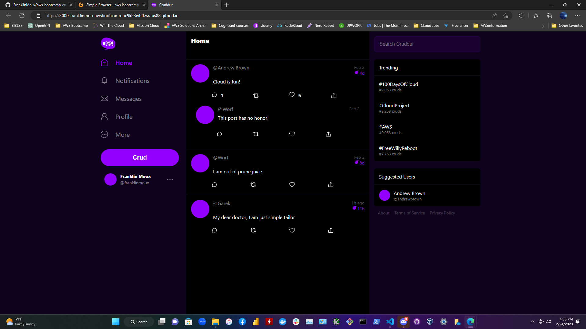

# Week 1 — App Containerization

### • Created a Dockerfile for the frontend and backend ran the containers and got the app running.

### • Got the app running and created a profile on the app. 

### • I was able to follow through the video for creating the notifications for backend and frontend.

### • I followed the video on creating the notification feature (Backend and Frontend) and got all the codes running. (commit and sync on my repo).

### • I watched all videos and completed both quizzes

### • However, I did not have time to go over the DynamoDB, Postgres vs Docker. I will do it ASAP.
