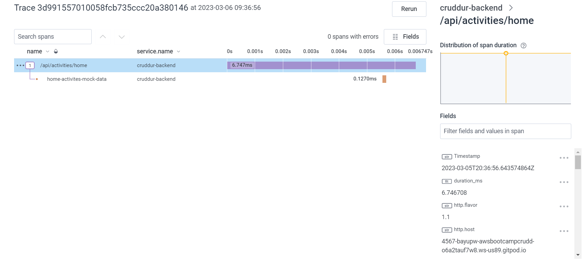
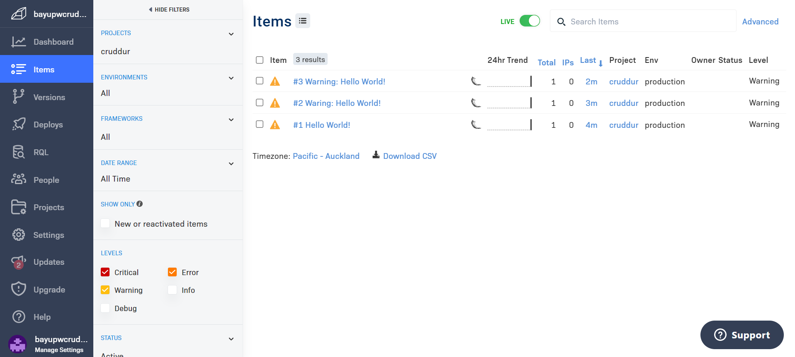

# Week 2 — Distributed Tracing

## HoneyComb

Make sure you have registered an account at honeycomb.io, create an new environment and take note of the API key.

Go to ```backend-flask``` directory and add the following line to the `requirements.txt` file

```
opentelemetry-api 
opentelemetry-sdk 
opentelemetry-exporter-otlp-proto-http 
opentelemetry-instrumentation-flask 
opentelemetry-instrumentation-requests
```

Install dependencies from the ```backend-flask``` directory

```sh
cd backend-flask
pip install -r requirements.txt
```

To initialize a tracer and Flask instrumentation to send data to Honeycomb, add the following code to the `app.py`. Reference: https://docs.honeycomb.io/getting-data-in/opentelemetry/python/#initialize

```py
from opentelemetry import trace
from opentelemetry.instrumentation.flask import FlaskInstrumentor
from opentelemetry.instrumentation.requests import RequestsInstrumentor
from opentelemetry.exporter.otlp.proto.http.trace_exporter import OTLPSpanExporter
from opentelemetry.sdk.trace import TracerProvider
from opentelemetry.sdk.trace.export import BatchSpanProcessor
```

```py
# Initialize tracing and an exporter that can send data to Honeycomb
provider = TracerProvider()
processor = BatchSpanProcessor(OTLPSpanExporter())
provider.add_span_processor(processor)
trace.set_tracer_provider(provider)
tracer = trace.get_tracer(__name__)

app = Flask(__name__)

# Initialize automatic instrumentation with Flask
FlaskInstrumentor().instrument_app(app)
RequestsInstrumentor().instrument()
```

Add the following Env Vars to `backend-flask:` under section `environment:` in `docker-compose.yml` file

```yml
      OTEL_EXPORTER_OTLP_ENDPOINT: "https://api.honeycomb.io"
      OTEL_EXPORTER_OTLP_HEADERS: "x-honeycomb-team=${HONEYCOMB_API_KEY}"
      OTEL_SERVICE_NAME: "cruddur-backend"
```

Set Honeycomb API key in environment variables:

```sh
export HONEYCOMB_API_KEY="honeycombapikeyhere"
```

To set it in gitpod environment variables, use ```gp env```

```sh
export HONEYCOMB_API_KEY="honeycombapikeyhere"
gp env HONEYCOMB_API_KEY="honeycombapikeyhere"
```

Set service name using environment variables `HONEYCOMB_API_KEY` or set hardcode `OTEL_SERVICE_NAME` in `docker-compose.yml`

```sh
export HONEYCOMB_SERVICE_NAME="cruddur"
gp env HONEYCOMB_SERVICE_NAME="cruddur"
```

```sh
cd frontend-react-js
npm install
cd ..
docker compose -f "docker-compose.yml" up
```

To add a (hardcoded) span do the following:
1. Import tracer by following this doc: https://docs.honeycomb.io/getting-data-in/opentelemetry/python/#acquiring-a-tracer
2. Create spans by following doc: https://docs.honeycomb.io/getting-data-in/opentelemetry/python/#creating-spans

Test this on `home_activities.py` file and add the following code for the tracer:
```py
from opentelemetry import trace

tracer = trace.get_tracer("home.activities")
```

For adding span, put all the existing `def (run):` code under a new span
```py
from opentelemetry import trace

tracer = trace.get_tracer("home.activities")
```py
class HomeActivities:
  def run():
    with tracer.start_as_current_span("home-activites-mock-data"):
     # existing code
     span.set_attribute("app.result_length", len(results))
     return results
```

Sample working trace and spans on Honeycomb as per the following screenshot




## AWS X-Ray


Go to ```backend-flask``` directory and add the following line to the `requirements.txt` file

```
aws-xray-sdk
```

Reference: https://docs.aws.amazon.com/xray/latest/devguide/xray-sdk-python.html

Install dependencies from the ```backend-flask``` directory

```sh
cd backend-flask
pip install -r requirements.txt
```

Add the following code to `app.py`

```py
from aws_xray_sdk.core import xray_recorder
from aws_xray_sdk.ext.flask.middleware import XRayMiddleware

app = Flask(__name__)

xray_url = os.getenv("AWS_XRAY_URL")
xray_recorder.configure(service='cruddur', dynamic_naming=xray_url)
XRayMiddleware(app, xray_recorder)
```

Create `xray.json` file under `aws/json` directory

```sh
mkdir -p aws/json
touch aws/json/xray.json
```

Add below code to the `xray.json` file

```json
{
  "SamplingRule": {
      "RuleName": "Cruddur",
      "ResourceARN": "*",
      "Priority": 9000,
      "FixedRate": 0.1,
      "ReservoirSize": 5,
      "ServiceName": "Cruddur",
      "ServiceType": "*",
      "Host": "*",
      "HTTPMethod": "*",
      "URLPath": "*",
      "Version": 1
  }
}
```

Create aws xray

```
FLASK_ADDRESS="https://4567-${GITPOD_WORKSPACE_ID}.${GITPOD_WORKSPACE_CLUSTER_HOST}"
aws xray create-group \
   --group-name "cruddur" \
   --filter-expression "service(\"cruddur-backend\") {fault OR error}"
```

To verify from AWS Console that x-ray group is created is created, go to CloudWatch > Settings > Traces tab > Under Groups, click View Settings
URL: https://<region>.console.aws.amazon.com/cloudwatch/home?region=<region>#settings:/traces

```sh
aws xray create-sampling-rule --cli-input-json file://aws/json/xray.json
```

To verify from AWS Console that sampling rule is created, go to CloudWatch > Settings > Traces tab > Under Sampling rules, click View Settings
URL: https://<region>.console.aws.amazon.com/cloudwatch/home?region=<region>#settings:/traces

Add aws `xray-daemon` to `services:` in `docker-compose.yml` file

```yml
  xray-daemon:
    image: "amazon/aws-xray-daemon"
    environment:
      AWS_ACCESS_KEY_ID: "${AWS_ACCESS_KEY_ID}"
      AWS_SECRET_ACCESS_KEY: "${AWS_SECRET_ACCESS_KEY}"
      AWS_REGION: "${AWS_DEFAULT_REGION}"
    command:
      - "xray -o -b xray-daemon:2000"
    ports:
      - 2000:2000/udp
```

Add the following Env Vars to `backend-flask:` under section `environment:` in `docker-compose.yml` file

```yml
      AWS_XRAY_URL: "*4567-${GITPOD_WORKSPACE_ID}.${GITPOD_WORKSPACE_CLUSTER_HOST}*"
      AWS_XRAY_DAEMON_ADDRESS: "xray-daemon:2000"
```

check service data for last 10 minutes

```sh
EPOCH=$(date +%s)
aws xray get-service-graph --start-time $(($EPOCH-600)) --end-time $EPOCH
```

```sh
cd frontend-react-js
npm install

export AWS_ACCESS_KEY_ID="keyid"
export AWS_SECRET_ACCESS_KEY="secretkey"
export AWS_DEFAULT_REGION="ap-southeast-2"

gp env AWS_ACCESS_KEY_ID="keyid"
gp env AWS_SECRET_ACCESS_KEY="secretkey"
gp env AWS_DEFAULT_REGION="ap-southeast-2"

docker compose -f "docker-compose.yml" up -d --build
```

## AWS CloudWatch

Go to ```backend-flask``` directory and add the following line to the `requirements.txt` file

```
watchtower
```

Install dependencies from the ```backend-flask``` directory

```sh
cd backend-flask
pip install -r requirements.txt
```

To use CloudWatch, add the following code to the `app.py`. Reference: https://pypi.org/project/watchtower/

```py
import watchtower
import logging
from time import strftime
```

```py
# Configuring Logger to Use CloudWatch
LOGGER = logging.getLogger(__name__)
LOGGER.setLevel(logging.DEBUG)
console_handler = logging.StreamHandler()
cw_handler = watchtower.CloudWatchLogHandler(log_group='cruddur')
LOGGER.addHandler(console_handler)
LOGGER.addHandler(cw_handler)
LOGGER.info("some message")
```

Add a new endpoint for testing AWS CloudWatch Logs to `app.py`

```py
@app.after_request
def after_request(response):
    timestamp = strftime('[%Y-%b-%d %H:%M]')
    LOGGER.error('%s %s %s %s %s %s', timestamp, request.remote_addr, request.method, request.scheme, request.full_path, response.status)
    return response
```

To log in the code, add the `LOGGER.info` code under the services e.g., home_activities.py

```py
class HomeActivities:
  def run():
    # --- CloudWatch logging ---
    LOGGER.info("HomeActivities")
```

Add the following Env Vars to `backend-flask:` under section `environment:` in `docker-compose.yml` file

```yml
      AWS_DEFAULT_REGION: "${AWS_DEFAULT_REGION}"
      AWS_ACCESS_KEY_ID: "${AWS_ACCESS_KEY_ID}"
      AWS_SECRET_ACCESS_KEY: "${AWS_SECRET_ACCESS_KEY}"
```

```sh
cd frontend-react-js
npm install

export AWS_ACCESS_KEY_ID="keyid"
export AWS_SECRET_ACCESS_KEY="secretkey"
export AWS_DEFAULT_REGION="ap-southeast-2"

gp env AWS_ACCESS_KEY_ID="keyid"
gp env AWS_SECRET_ACCESS_KEY="secretkey"
gp env AWS_DEFAULT_REGION="ap-southeast-2"

docker compose -f "docker-compose.yml" up -d --build
```

## Rollbar

https://rollbar.com/

Go to ```backend-flask``` directory and add the following line to the `requirements.txt` file

```
blinker
rollbar
```

Install dependencies from the ```backend-flask``` directory

```sh
cd backend-flask
pip install -r requirements.txt
```

To use Rollbar, add the following code to the `app.py`. Reference: [Rollbar Flask Example](https://github.com/rollbar/rollbar-flask-example/blob/master/hello.py)

```py
import rollbar
import rollbar.contrib.flask
from flask import got_request_exception
```

```py
rollbar_access_token = os.getenv('ROLLBAR_ACCESS_TOKEN')
@app.before_first_request
def init_rollbar():
    """init rollbar module"""
    rollbar.init(
        # access token
        rollbar_access_token,
        # environment name
        'production',
        # server root directory, makes tracebacks prettier
        root=os.path.dirname(os.path.realpath(__file__)),
        # flask already sets up logging
        allow_logging_basic_config=False)

    # send exceptions from `app` to rollbar, using flask's signal system.
    got_request_exception.connect(rollbar.contrib.flask.report_exception, app)
```

Add a new endpoint for testing rollbar to `app.py` and report level message as `Warning`

```py
@app.route('/rollbar/test')
def rollbar_test():
    rollbar.report_message('Warning: Hello World!', 'warning')
    return "Warning: Hello World!"
```

Add the following Env Var to `backend-flask:` under section `environment:` in `docker-compose.yml` file

```yml
ROLLBAR_ACCESS_TOKEN: "${ROLLBAR_ACCESS_TOKEN}"
```

```sh
cd frontend-react-js
npm install

export ROLLBAR_ACCESS_TOKEN="rollbar access token"
gp env ROLLBAR_ACCESS_TOKEN="rollbar access token"

cd ..
docker compose -f "docker-compose.yml" up
```

