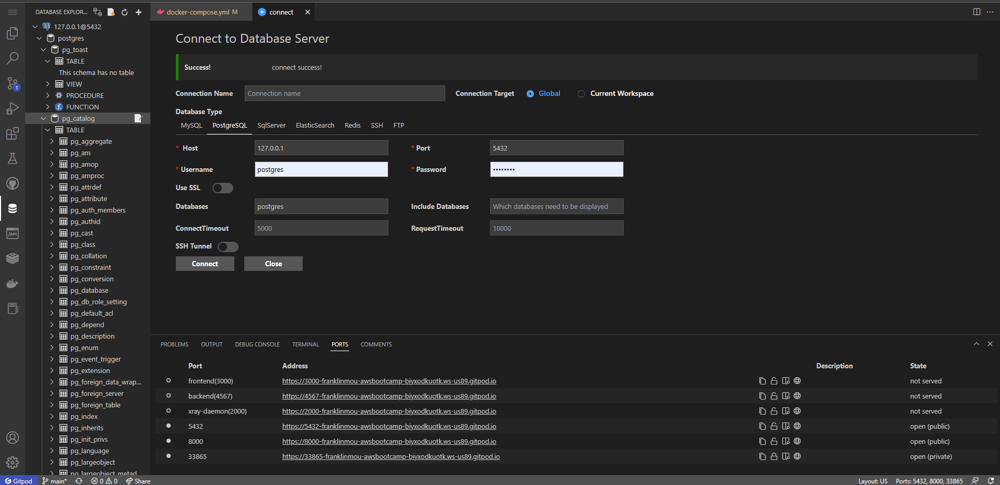

# Week 2 — Distributed Tracing

I installed DynamoDB local and Postgres by following Week-1 video. 

Then I watched Ashish's video on "Observability Security Considerations" which explained about the nuances between Observability and Monitoring, the AWS services used for that purpose such as CloudWatch (logs, metrics, tracing), CloudTrail, EventBridge (event driven security), AWS Detective. That helped me to understand the importance of Week 2 focus.

 Then I needed to rewatch the videos to be able to configure OTEL to Honeycomb 
 
 Our special guest: Jessica Joy Kerr [https://www.linkedin.com/in/jessicakerr/](https://www.linkedin.com/in/jessicakerr/) shared a link to show the API used for Honeycomb.io https://honeycomb-whoami.glitch.me/
 
 and to instrument AWs X-Ray.

 Then I configured a custom logger to send to the CloudWatch Logs

 and finally I integrated Rollbar and captured some errors.

I watched Lou's invaluable video on cloud roles and working on his templates to better focus on what I need to do and stop wasting time for unessential topics.

I added Codespace for repo access.
